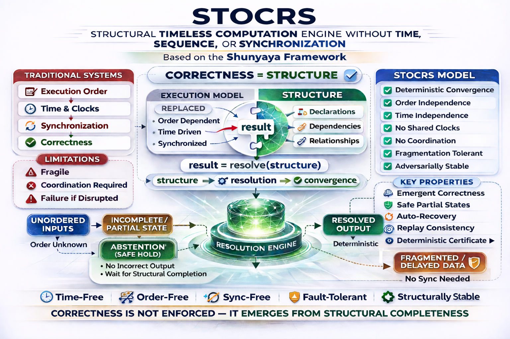

# ⭐ **STOCRS**

## **Shunyaya Timeless Computation**

[](https://github.com/OMPSHUNYAYA/STOCRS/actions/workflows/verify.yml)


**Deterministic • Time-Independent • Sequence-Free • Convergence-Based Computation • Open Reference Implementation**

**No GPS • No NTP • No Internet • No Global Clock • No Central Authority Required for Correctness**

---

**Correctness derived from structure — not time, not sequence, not synchronization**

Using concepts from **Shunyaya Structural Universal Mathematics (SSUM)**

---

## 🧾 **One-Line Story**

From **SSUM-Time** (time reconstructed from structure)  
to **STOCRS** (computation reconstructed from structure):

A deterministic, offline, replay-verifiable model  
where **correctness emerges from structure alone**.

---

## ⚡ **A Radical Idea**

STOCRS explores a simple but profound possibility:

**Computation may not need time, order, or synchronization — it can be structurally resolved**

Instead of relying on:

- execution order  
- timestamps  
- global clocks  
- synchronized systems  

STOCRS demonstrates:

- incomplete fragments can exist safely  
- order can remain unknown  
- time can diverge across systems  
- sharing can be partial and delayed  

And still:

**the same final result emerges deterministically**

This idea builds on a deeper insight from SSUM-Time — that time itself can be reconstructed from structure.  
STOCRS extends this principle further: **if time can emerge from structure, computation can as well.**

---

## ⚖️ **What STOCRS Is / Is Not**

### **STOCRS IS:**
- a structural computation model  
- a deterministic convergence system  
- a proof that correctness does not require time or order  
- a reference architecture for structure-driven systems  

### **STOCRS IS NOT:**
- a timing optimization  
- a faster distributed database  
- a replacement for all existing systems  
- a consensus protocol  

**It is a deeper shift:**

**correctness is derived from structure, not from coordination.**

---

## 🧩 **STOCRS Structural Model**



*Fragmented systems converge to identical final truth without time, order, or synchronization*

---

## 🧭 **STOCRS Core Principle**

`correctness = structure`

Not:

`correctness = time + sequence + synchronization`

---

## ⚡ **What This Proves (In One Line)**

Independent systems can begin differently, remain incomplete, operate without time or coordination, and still converge deterministically to the same final truth.

---

## ⚡ **Why This Matters**

Modern distributed systems assume:

- time must be synchronized  
- events must be ordered  
- systems must coordinate continuously  

STOCRS introduces an alternative:

**truth can emerge from structure — even when time, order, and synchronization are absent**

This enables:

- computation without global clocks  
- recovery without replay logs  
- convergence without coordination  
- correctness without ordering guarantees  

---

## 🛡 **Classical Compatibility Guarantee**

STOCRS is a conservative structural extension of computation.

For all structurally valid computations:

`classical result = STOCRS result`

STOCRS does not change correctness.  
It governs when correctness can emerge.

- dependencies satisfied → correctness emerges  
- dependencies incomplete → no result emerges  
- conflicting structure → no valid result emerges  

No incorrect result is ever produced.  
STOCRS preserves classical correctness through structural discipline.

---

## 🔗 Quick Links

### 📘 Docs

- [Quickstart](docs/Quickstart.md)
- [FAQ](docs/FAQ.md)
- [Convergence Proof](docs/Convergence-Proof.md)
- [Validation Ledger](docs/Validation_Ledger.md)
- [Concept Flyer](docs/Concept-Flyer_STOCRS_v1.8.pdf)
- [STOCRS Paper](docs/STOCRS_v1.8.pdf)
- [STOCRS Structural Model](docs/STOCRS.png)
- [Shunyaya Structural Paradigm](docs/Shunyaya-Structural-Paradigm.png)

---

### 📂 Repo

- [demo/](demo/) — canonical + reconciliation demos  
- [runtime/](runtime/) — STOCRS engine  
- [reference_outputs/](reference_outputs/) — deterministic outputs  
- [VERIFY/](VERIFY/) — reproducibility + hash validation  
- [historical_scripts/](historical_scripts/) — evolution trace  
- [docs/](docs/) — full documentation bundle  

---

### ⚡ Run

```
python demo/stocrs_canonical_demo.py --seed 101 --systems 5
```

Verify:

```
compare → reference_outputs  
hash → VERIFY/FREEZE_*.txt
```

---

## 📊 **Comparison Snapshot**

| Model                 | Requires Time | Requires Order | Requires Sync | Handles Incomplete Safely | Deterministic Convergence |
|----------------------|--------------|----------------|---------------|---------------------------|---------------------------|
| Traditional Systems  | YES          | YES            | YES           | NO                        | CONDITIONAL               |
| Eventual Consistency | SOMETIMES    | SOMETIMES      | YES           | PARTIAL                   | CONDITIONAL               |
| CRDTs                | NO           | PARTIAL        | YES           | YES                       | YES                       |
| **STOCRS**           | **NO**       | **NO**         | **NO**        | **YES**                   | **YES**                   |

### **Key Difference**

STOCRS does not coordinate correctness.  
It allows correctness to **emerge from structure**.

---

## 🧭 **Development Journey**

```
v1 → structural resolution proof  
v2 → fragmented system behavior  
v3 → isolation and independence  
v4 → scale and graph growth  
v5 → convergence under disorder  
v6 → bounded sharing model  
v7 → conflict emergence  
v8 → abstention and recovery  
v9 → deterministic convergence validation  
v10 → canonical STOCRS engine  
```

**Result**

A complete structural computation model  
with **deterministic, replay-verifiable convergence**.

---

## 🌐 **Canonical Demo (Deterministic Proof)**

### **Scenario**

- 5 independent systems  
- no GPS  
- no NTP  
- no internet  
- different incomplete initial fragments  
- bounded partial sharing  
- prolonged unresolved states  
- different internal local times  

### **Outcome**

All systems converge to the same final result  

Without using:

- time  
- sequence  
- synchronization  
- external authority  

---

## 📊 **Convergence Proof (Order & Time Independence)**

| Run | Input Condition          | Arrival Order | Local Time | Final Result | Match |
|-----|--------------------------|---------------|------------|--------------|-------|
| 1   | Random fragments         | Random        | Different  | E1 = 202     | YES   |
| 2   | Reversed input           | Reversed      | Different  | E1 = 202     | YES   |
| 3   | Fragmented + delayed     | Mixed         | Different  | E1 = 202     | YES   |
| 4   | Partial sharing          | Partial       | Different  | E1 = 202     | YES   |
| 5   | Conflict scenario        | Random        | Different  | E1 = 202     | YES   |

### **Invariant**

`arrival_A != arrival_B -> result_A == result_B`

---

## ⚖️ **Conflict Resolution Model**

**Behavior**

- agreement → resolve  
- ambiguity → abstain  
- stronger structural support → resolve  

**Guarantee**

- conflict does not corrupt truth  
- abstention preserves correctness  
- resolution requires structural justification  

---

## 🚀 **Quick Start (30 Seconds)**

Run the canonical demo:

```
python demo/stocrs_canonical_demo.py --seed 101 --systems 5
```

### **Expected Output**

```
No GPS: YES  
No NTP: YES  
No Internet: YES  
Time Used for Correctness: NO  

Final Complete OK: YES  
Final Match OK: YES  

Final Node Count: 20  
Final E1: 202
```

---

## ✨ **Key Features**

- Deterministic structural computation  
- No reliance on time, sequence, or synchronization  
- Safe unresolved states  
- Bounded sharing  
- Multi-phase convergence  
- Multi-system consistency  
- Adversarial resilience  
- Conflict-aware resolution with abstention  
- Replay-verifiable outputs  

---

## 🧠 **Structural Computation Model**

STOCRS operates as a structural resolution system:

- nodes represent values or expressions  
- dependencies define structure  
- resolution occurs only when dependencies are satisfied  

**Key Idea**

Structure governs correctness  
Time is irrelevant to correctness  

---

## 🔁 **Multi-System Convergence Model**

Each system may have:

- different starting fragments  
- different arrival orders  
- different missing information  
- different local clocks  

Yet:

- structure accumulates  
- dependencies resolve  
- truth emerges  

**Convergence is guaranteed by structure, not coordination**

---

## 🛡 **Unresolved State Model**

Unresolved is not failure.  
Unresolved is not error.

It is:

**structurally valid incompleteness**

---

## 🔎 **No Time, No Order, No Authority**

STOCRS does not require:

- clocks  
- timestamps  
- event ordering  
- synchronization  
- central authority  

---

## 🌍 **Where STOCRS Matters**

- Distributed Systems  
- Edge / Offline Systems  
- Recovery Systems  
- Data Reconciliation  
- Resilient Infrastructure  
- AI / Observability  

---

## 🧭 **Architectural Shift**

Traditional systems:

`time + order + synchronization -> correctness`

STOCRS:

`structure -> correctness`

---

## 📜 **License**

See: [LICENSE](LICENSE)

Reference Implementation: **Open Standard**  
Architecture: CC BY-NC 4.0

---

## 🔗 **SSUM-Time Reference**

A deterministic structural time engine — No GPS • No NTP • No Internet — reconstructing time from cycle alignment with replay-verifiable accuracy.

https://github.com/OMPSHUNYAYA/SSUM-Time

---

## 🌍 **Civilization-Level Implication**

If correctness does not depend on time → systems can function without global clocks  
If correctness does not depend on order → systems can function without coordination  
If correctness does not depend on synchronization → systems can operate independently  

---

# ⭐ **One-Line Summary**

**STOCRS demonstrates that independent systems can begin differently, remain incomplete, operate without time, order, synchronization, GPS, NTP, or internet — and still converge deterministically to the same final truth using structure alone.**
