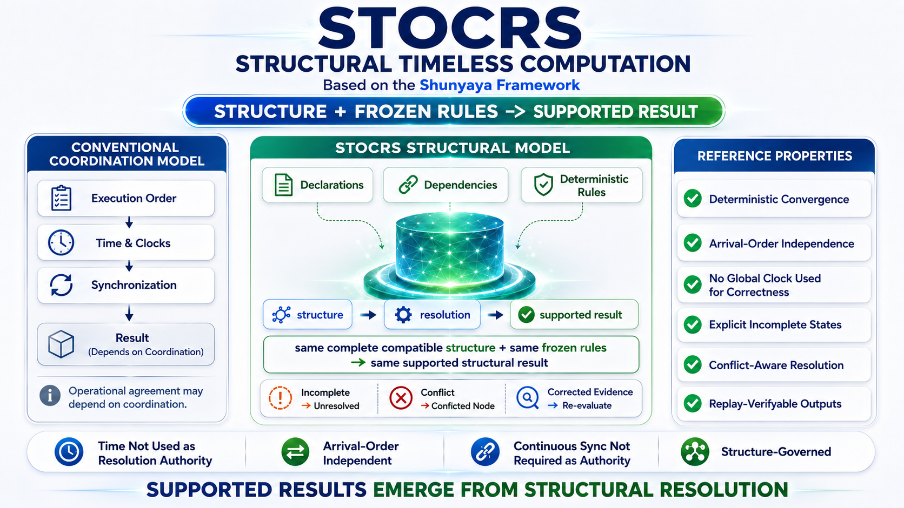

# ⭐ **STOCRS**

## **Shunyaya Timeless Computation**


**Deterministic • Structure-Driven • Explicit Incompleteness • Conflict-Aware • Replay-Verifiable • Open Reference Implementation**

**No GPS • No NTP • No Internet • No Global Clock Used for Correctness in the Declared Reference Cases**

---

**Resolution derived from declared structure and frozen rules — not from timestamps, arrival order, or claim multiplicity**

Developed within the **Shunyaya Framework**, with conceptual roots in **Shunyaya Structural Universal Mathematics (SSUM)**.

---

## 🧾 **One-Line Story**

From **SSUM-Time** — where structural relations can support deterministic time reconstruction —  
to **STOCRS** — where declared computational structure governs when a result is resolvable:

A deterministic, offline, replay-verifiable reference model in which:

`same declared structure + same frozen rules -> same supported structural result`

---

## ⚡ **The Core Idea**

STOCRS explores a bounded but important possibility:

**A computation does not always need timestamps, arrival order, or continuous synchronization to determine its result.**

In the STOCRS reference model:

- systems may begin with different incomplete fragments
- fragments may arrive in different orders
- local clock values may differ
- intermediate states may remain unresolved
- conflicting claims do not gain authority through repetition

When the same complete compatible structure becomes available under the same frozen rules, the supported result is deterministic.

The central distinction is:

`transport history != resolution authority`

`claim multiplicity != structural authority`

`declared structure + frozen rules -> computational authority`

---

## ⚖️ **What STOCRS Is / Is Not**

### **STOCRS IS:**

- a reference model for structure-driven deterministic computation
- a dependency-governed resolution system
- a demonstration of explicit unresolved states under incomplete structure
- a demonstration of deterministic final agreement once the same complete compatible structure is available
- a conflict-aware reference implementation in which incompatible claims cannot override declared computation
- a replay-verifiable research implementation

### **STOCRS IS NOT:**

- a proof that every computation can ignore time or order
- a guarantee that partial sharing alone will eventually disseminate all required structure
- a consensus protocol
- a distributed database
- a replacement for all execution, transport, synchronization, or coordination mechanisms
- a production safety certification

STOCRS concerns **resolution authority**.

Physical execution may still occur in time.  
Information may still need to move between systems.  
A production deployment may still require networking, persistence, authentication, access control, and operational coordination.

The STOCRS claim is narrower:

**within the declared model, those mechanisms are not used as the authority that determines the supported computational result.**

---

## 🧩 **STOCRS Structural Model**



*Different incomplete views may remain unresolved. The same complete compatible structure, evaluated under the same frozen rules, yields the same supported result.*

---

## 🧭 **STOCRS Core Relations**

`same declared structure + same frozen rules -> same supported structural result`

`incomplete structure -> unresolved`

`conflicting claims -> conflict at the affected node`

`affected dependency unavailable -> dependent result remains unresolved`

`corrected compatible evidence -> structural resolution may proceed again`

---

## ⚡ **What the Current Reference Cases Demonstrate**

The current reference implementation demonstrates that:

- different initial fragments can coexist without forcing premature resolution
- different arrival orders do not alter the tested final result once the same complete compatible structure is available
- divergent local clock values are not used to determine the computational result
- bounded intermediate sharing can leave systems explicitly unresolved
- explicit completion with the same compatible structure produces the same final state across the tested systems
- conflicting claim multiplicity cannot override the value computed by declared structure
- corrected compatible evidence can allow structural resolution to proceed again
- frozen reference artifacts can be checked through replay and SHA-256 verification

These are **reference-case results**, not universal claims about all distributed computation.

---

## 🛡 **Classical Compatibility**

For computations represented by the declared STOCRS program:

`structurally supported result = result of the declared computation`

STOCRS does not redefine the underlying arithmetic or program functions.

Instead, it governs when a node may resolve:

- dependencies satisfied and structure compatible -> resolve
- required dependencies absent -> remain unresolved
- conflicting claims present -> do not use claim multiplicity as authority
- claim disagrees with declared computation -> reject the claim as structurally incompatible

The implementation therefore separates:

`computation rule`

from:

`evidence about the computation`

Evidence may corroborate a structurally computed value.  
Evidence does not replace declared computational authority.

---

## 🔗 **Quick Links**

### 📘 Documentation

- [Quickstart](docs/Quickstart.md)
- [FAQ](docs/FAQ.md)
- [Convergence Proof](docs/Convergence-Proof.md)
- [Validation Ledger](docs/Validation_Ledger.md)
- [Concept Flyer](docs/Concept-Flyer_STOCRS_v1.8.pdf)
- [STOCRS Paper](docs/STOCRS_v1.8.pdf)
- [STOCRS Structural Model](docs/STOCRS.png)
- [Shunyaya Structural Paradigm](docs/Shunyaya-Structural-Paradigm.png)

### ⚙️ Current Reference Implementation

- [Canonical Demo v1.2](demo/stocrs_canonical_demo_v1_2.py)
- [Reconciliation Demo v1.1](demo/stocrs_reconciliation_demo_v1_1.py)
- [Illustrative POC Demo](demo/stocrs_poc_demo.py)
- [Runtime Engine v1.1](runtime/stocrs_engine_v1_1.py)
- [Reference Outputs](reference_outputs/)
- [Verification Bundle](VERIFY/)
- [Historical Scripts](historical_scripts/)

The POC demo is an illustrative introductory script.  
The canonical demo, runtime engine, frozen reference outputs, and verification bundle form the current verification path.

---

## ⚡ **Run**

Run the canonical demo:

```text
python demo/stocrs_canonical_demo_v1_2.py --seed 101 --systems 5
```

Run the runtime conflict demonstration:

```text
python runtime/stocrs_engine_v1_1.py --conflict-demo
```

Run the complete verification:

```text
VERIFY\verify_all.bat
```

Expected final verifier status:

```text
VERIFY RESULT: PASS
```

---

## 📊 **Reference Property Snapshot**

| Property | Current STOCRS Reference Model |
|---|---|
| Global clock used for computational correctness | NO |
| GPS or NTP required by the reference demo | NO |
| Internet required by the reference demo | NO |
| Arrival order used as resolution authority | NO |
| Continuous synchronization required for the tested final result | NO |
| Incomplete structure represented explicitly | YES |
| Conflicting claim multiplicity used as authority | NO |
| Same complete compatible structure + same frozen rules yields the same tested result | YES |
| Replay and hash verification provided | YES |

---

## 🧭 **Development Journey**

The historical scripts preserve the evolution of the idea:

`v1 -> structural resolution under reordered input`

`v2 -> incomplete state followed by explicit completion`

`v3 -> divergent local clock conditions`

`v4 -> larger dependency graph`

`v5 -> multiple independent systems`

`v6 -> duplicate and invalid-token filtering`

`v7 -> explicit claim-conflict handling`

`v8 -> partial sharing followed by explicit complete structure`

`v9 -> tighter bounded sharing followed by explicit complete structure`

The current reference implementation then adds:

- a reusable runtime engine
- a canonical multi-system demonstration
- explicit conflict abstention
- recovery after conflicting evidence is corrected or removed
- frozen reference outputs
- replay and SHA-256 verification

Historical scripts are retained as an evolution trace and should not be read as stronger guarantees than the individual scenarios they implement.

---

## 🌐 **Canonical Demo**

### **Scenario**

The canonical reference case uses:

- 5 systems
- different incomplete initial fragments
- different fragment orders
- bounded intermediate sharing
- prolonged unresolved states
- different reconstructed local-time values
- explicit final availability of the complete declared structure

### **Outcome**

Once each system receives the same complete compatible structure:

- `Final Complete OK: YES`
- `Final Match OK: YES`
- `Final Node Count: 20`
- `Final E1: 202`

The result is not selected from clock values, timestamps, fragment arrival order, or vote count.

---

## 📊 **Convergence Demonstration**

| Stage | Structural Condition | Expected Resolution State |
|---|---|---|
| Initial fragments | Different and incomplete | UNRESOLVED EXISTS |
| Bounded sharing | More structure, still incomplete | UNRESOLVED EXISTS |
| Complete compatible structure | Same declared nodes and rules available | COMPLETE |
| Final comparison | Same supported values across systems | MATCH |
| Conflict injection | Distinct claims for `X1` | CONFLICT AT `X1`; DEPENDENT `A1` UNRESOLVED |
| Corrected evidence | Compatible claim set restored | RESOLUTION PROCEEDS AGAIN |

### **Reference Invariant**

For the tested complete compatible states:

`same structure + same rules -> same result`

Arrival order may differ without becoming computational authority.

---

## ⚖️ **Conflict Model**

The current runtime follows these rules:

- no claim -> compute from declared structure when dependencies are available
- one distinct claimed value matching declared computation -> accept as compatible evidence
- one distinct claimed value disagreeing with declared computation -> `claim_vs_structure`
- more than one distinct claimed value -> `multi_value_conflict`
- conflicting or incompatible claim -> do not resolve that node from the claim
- dependent node without its required resolved dependency -> remain unresolved
- corrected or removed conflicting evidence -> resolution may proceed again

### **Authority Rule**

`claim multiplicity != structural authority`

A repeated incorrect claim does not become correct by appearing more often.

Declared structure and frozen computation rules remain authoritative within the reference model.

---

## 🚀 **Quick Start**

Run:

```text
python demo/stocrs_canonical_demo_v1_2.py --seed 101 --systems 5
```

### **Expected Output**

```text
No GPS: YES
No NTP: YES
No Internet: YES
Time Used for Correctness: NO

Final Complete OK: YES
Final Match OK: YES

Final Node Count: 20
Final E1: 202

Stable OK: YES
Conflict OK: YES
Recovery OK: YES
```

For the complete folder layout, verification commands, expected files, and reproduction procedure, see the [Quickstart](docs/Quickstart.md) and [Verification Bundle](VERIFY/).

---

## ✨ **Key Features**

- deterministic structural resolution
- explicit incomplete states
- dependency-governed computation
- arrival-order independence in the declared reference cases
- clock-independent resolution authority in the declared reference cases
- bounded intermediate sharing demonstrations
- multi-system final-state comparison
- conflict abstention
- claim-versus-structure validation
- recovery after conflicting evidence is corrected or removed
- deterministic canonical reference output
- replay and SHA-256 verification

---

## 🧠 **Structural Computation Model**

STOCRS represents computation as a dependency structure:

- nodes represent declared values or expressions
- dependencies determine which prior values are required
- a node resolves only when its declared dependencies are available
- deterministic functions compute the supported value
- claims may be checked against that supported value
- conflicting evidence cannot replace structural authority

The core idea is:

`structure determines resolvability`

`declared computation determines supported value`

---

## 🔁 **Multi-System Resolution**

Different systems may have:

- different starting fragments
- different fragment arrival orders
- different missing information
- different local clock values

During incompleteness, they may hold different partial states.

The reference model does not claim that bounded sharing alone guarantees complete dissemination.

Instead:

`same eventual complete compatible structure + same frozen rules -> same supported final result`

---

## 🛡 **Unresolved Is a Valid State**

Unresolved is not automatically failure.

Within STOCRS it means:

**the declared structure currently available is insufficient to support the requested result.**

The system does not need to invent a value merely because a value is desired.

---

## 🔎 **What STOCRS Does Not Use as Resolution Authority**

Within the declared reference implementation, computational correctness is not selected by:

- wall-clock time
- timestamps
- GPS
- NTP
- fragment arrival order
- continuous synchronization
- claim majority

This does not mean those mechanisms have no operational use.

It means they are not the authority that determines the supported computational result in the reference cases.

---

## 🌍 **Potential Areas of Relevance**

The STOCRS model may be relevant to research and system design involving:

- distributed computation
- edge and offline systems
- recovery and reconstruction
- data reconciliation
- intermittently connected systems
- deterministic replay
- audit-oriented computation
- conflict-aware structural resolution

Production use in any such domain requires independent validation beyond the current reference implementation.

---

## 🧭 **Architectural Shift**

A coordination-heavy model may use:

`time + order + synchronization -> operational agreement`

The STOCRS reference model asks whether some computational decisions can instead use:

`declared structure + frozen rules -> supported result`

This is a shift in **resolution authority**, not a claim that physical execution, communication, or coordination disappear.

---

## 📜 **License**

See: [LICENSE](LICENSE)

The repository is a publicly available reference implementation under its stated license terms.

Use of the software, documentation, architecture, and related materials is governed by the licensing terms declared in the repository.

The repository does not claim recognition as a formal technical standard.

---

## 🔗 **Related Systems**

### **SSUM-Time**

A deterministic structural time reference system exploring time reconstruction without GPS, NTP, or internet as correctness inputs.

[Explore SSUM-Time](https://github.com/OMPSHUNYAYA/SSUM-Time)

### **STOCRS-R — Structural Resolution**

Reusable deterministic structural application evolution without procedural sequencing as resolution authority.

[Explore STOCRS-R](https://github.com/OMPSHUNYAYA/STOCRS-R)

---

## 🧱 **Cross-System Structural Map**

Across the wider Shunyaya ecosystem, multiple projects explore a related design question:

**Can a dependency that is usually treated as correctness authority be reduced, isolated, or removed from that role while preserving a declared invariant?**

| Domain | System | Dependency Examined | Structural Role Explored |
|---|---|---|---|
| Computation | [SLANG-Computation](https://github.com/OMPSHUNYAYA/SLANG-Computation) | Execution flow | Structure |
| Computation | [STOCRS](https://github.com/OMPSHUNYAYA/STOCRS) | Time / arrival order as result authority | Structure |
| Arithmetic | [SVARE](https://github.com/OMPSHUNYAYA/SVARE) | Procedural evaluation pathways | Structure |
| Time | [STIME](https://github.com/OMPSHUNYAYA/Structural-Time) | Physical clocks as progress authority | Structure |
| Time | [SSUM-Time](https://github.com/OMPSHUNYAYA/SSUM-Time) | External time sources | Structure |
| Ordering | [ORL](https://github.com/OMPSHUNYAYA/Orderless-Ledger) | Event order | Structure |
| Connectivity | [STINT-Money](https://github.com/OMPSHUNYAYA/STINT-Money) | Continuous connectivity | Structure |
| Communication | [STILE](https://github.com/OMPSHUNYAYA/STILE) | Transport as delivery authority | Structure |
| Traversal | [STRAL-Path](https://github.com/OMPSHUNYAYA/STRAL-Path) | Traversal / search | Structure |
| Infrastructure | [STIC](https://github.com/OMPSHUNYAYA/STIC) | Infrastructure dependency | Structure |
| Media | [STRUMER](https://github.com/OMPSHUNYAYA/STRUMER) | Manual workflow dependency | Structure |
| Finance | [SLANG-Money](https://github.com/OMPSHUNYAYA/SLANG-Money) | Transaction sequencing | Structure |
| Audit | [SLANG-Audit](https://github.com/OMPSHUNYAYA/SLANG-Audit) | Verification workflow | Structure |

The exact claim boundary differs by project.

The shared architectural question is whether a system can preserve its declared invariant while moving authority away from a conventional external dependency and into explicit structure.

---

## 🌍 **Broader Implication**

Where the required structure is complete, compatible, and governed by deterministic rules:

- correctness may not need a global clock as authority
- correctness may not need arrival order as authority
- correctness may not need continuous synchronization as authority

STOCRS provides a bounded reference implementation of that idea for deterministic structural computation.

---

# ⭐ **One-Line Summary**

**STOCRS demonstrates, within its declared reference cases, that systems can begin with different incomplete fragments and different local clock values, remain unresolved while structure is incomplete, reject conflicting claims as computational authority, and converge to the same deterministic result once the same complete compatible structure is available under the same frozen rules.**
